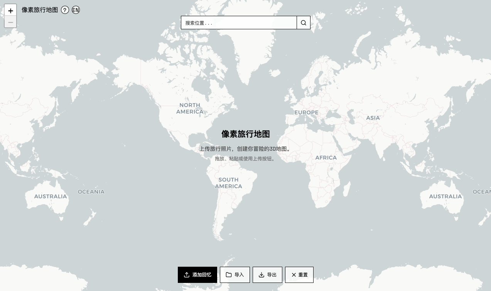

<div align="center">

</div>

# 🗺️ Pixel Travel Map

> ✨ 一个 AI 驱动的互动式「旅游打卡地图」 

> 🇺🇸 English version available in [here](./README.md)

---

## 📍 项目简介

「Pixel Travel Map」是一个互动式旅行地图工具。你只需上传一张旅拍照片（建筑或地标），系统会自动识别照片中的 GPS 信息，为你生成一个像素风格的 3D 模型，并放置到世界地图上的对应位置。

当你不断上传更多照片，就会慢慢构建起一个**专属的旅游打卡地图** ✈️🗺️

---

## ✨ 功能特色

- 📷 自动读取照片中的 GPS 坐标（支持 EXIF）
- 🌍 也可手动点击地图进行定位放置
- 🧱 使用 Nano-banana 生成像素风格的 3D 地标模型
- 🗺️ 支持拖动、翻转、放大、复制、编辑模型
- 🔒 一键锁定模型，转换为卡片式回忆管理
- 📝 每个地标都支持添加旅行笔记和拍摄日期
- 📸 支持上传更多照片作为补充回忆
- 💾 支持导出和导入地图数据，便于备份、迁移或分享

---

## 🎥 视频演示

<p><b>点击图片观看演示视频</b></p>
<div align="center">
<a href="https://www.bilibili.com/video/BV11dYjzREGd/?spm_id_from=333.1387.homepage.video_card.click&vd_source=180b54ccdee7adafa153cde5e97d8245"></a>
</div>

---

## 🧪 在线体验

👉 **[AI Studio 在线使用入口](https://ai.studio/apps/drive/113edx7Jx0lFvbYKOFW8cxh5azo4p4SBA)**

## 🚀 本地运行

### 前置条件

- 安装 Node.js ≥ 18

### 运行步骤

```bash
npm install
echo "GEMINI_API_KEY=你的API密钥" > .env.local
npm run dev
```

## 💡 致谢

灵感来源于 Alexander Chen 的[推文](https://x.com/alexanderchen/status/1961169243199672648)